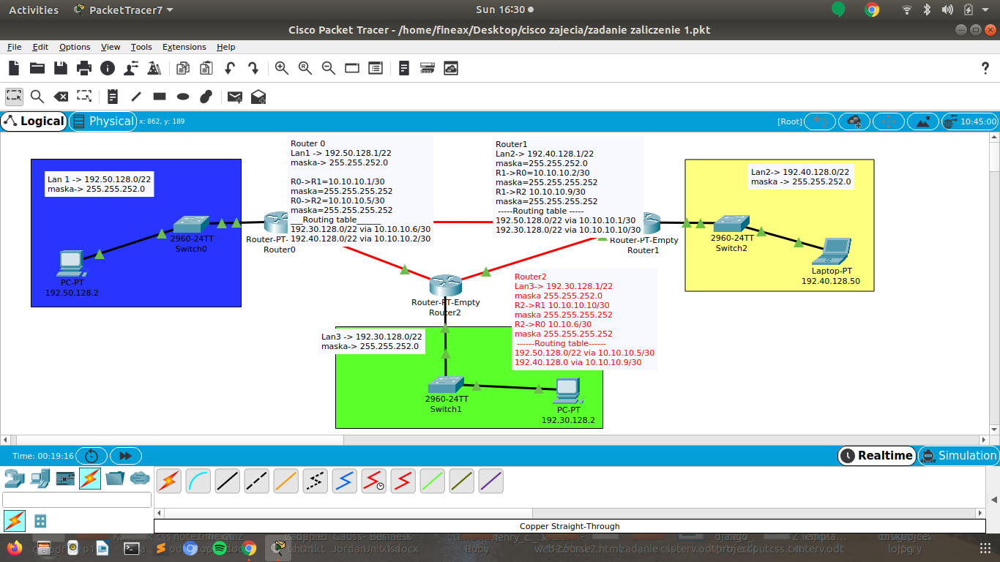

# Zadanie 1

Organizacja planuje rozpoczęcie działalności w 3 budynkach, w każdym z nich przewiduje do 1000 urządzeń IP

1. Zaprojektuj oraz udokumentuj prototyp rozwiązania z wykorzystaniem oprogramowania ``CISCO Packet Tracer``, ``VirtualBox`` lub podobnego. 

## Schemat

## Zawartość

 * Adresy poszczególnych sieci IP
 * Adresację linków pomiędzy routerami
 * Tablice routingów na poszczególnych routerach
 
 ## Rozwiązanie

# Śieci
* Śieć Lan1:  
Adres 192.50.128.0/22  
Maska podsieci 255.255.252.0  
Switch  
PC 192.50.128.2  

* Śieć Lan2   
Adres 192.40.128.0/22  
Maska podsieci 255.255.255.255.0  
Switch  
PC 192.40.128.50  

* Śieć Lan3  
Adres 192.30.128.0/22  
Maska 255.255.252.0  
Switch  
Pc 192.30.128.2  
# Routery

* Router 0  
EthLan1 adres: 192.50.128.1/22  
Maska: 255.255.252.0  
EthR0->R1: 10.10.10.1/30  
Maska: 255.255.255.252  
EthR0->R2: 10.10.10.5/30  
Maska: 255.255.255.252  
___Routing table______  
192.30.128.0/22 via 10.10.10.6/30  
192.40.128.0/22 via 10.10.10.2/30  

* Router 1  
EthLan2: 192.40.128.1/22  
Maska: 255.255.252.0  
EthR1->R0: 10.10.10.2/30  
Maska: 255.255.255.252  
EthR1: R2 10.10.10.9/30  
Maska: 255.255.255.252  
 -----Routing table -----  
192.50.128.0/22 via 10.10.10.1/30  
192.30.128.0/22 via 10.10.10.10/30  

* Router 2  
EthLan3: 192.30.128.1/22  
Maska 255.255.252.0  
EthR2->R1: 10.10.10.10/30  
Maska 255.255.255.252  
EthR2->R0: 10.10.10.6/30  
Maska: 255.255.255.252  
 ------Routing table------  
192.50.128.0/22 via 10.10.10.5/30  
192.40.128.0 via 10.10.10.9/30  
