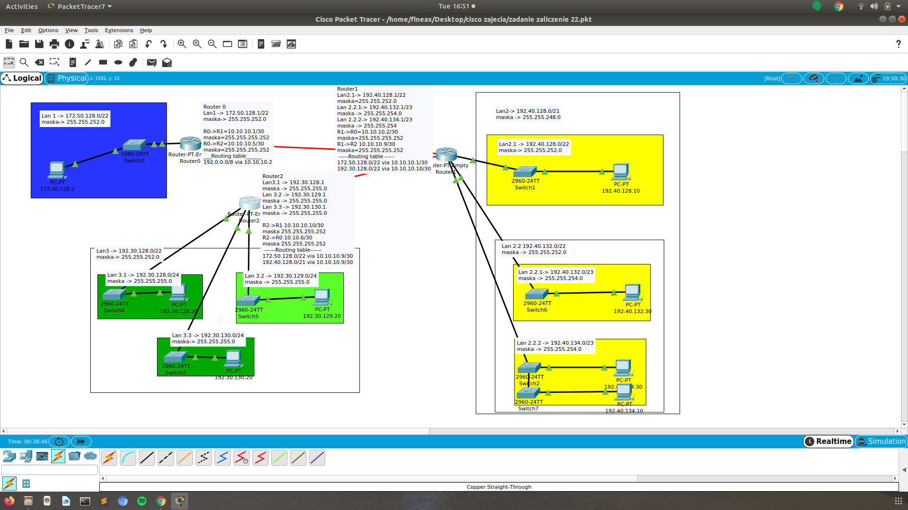

# Zadanie 2

Projekt sieci spełnił oczekiwania, organizacja po uwzględnieniu nowych wymogów chce podzielić dotychczasowe sieci na kilka podsieci.

1. Zaprojektuj oraz udokumentuj prototyp rozwiązania z wykorzystaniem oprogramowania ``CISCO Packet Tracer``, ``VirtualBox`` lub podobnego. 

## Schemat

## Charakterystyka
  * LAN 1 pozostaje bez zmian
  * LAN 2 zostaje podzielony na 3 równe podsieci
  * LAN 3 zostaje podzielony na 3 podsieci z uwzględnieniem
    * podsieć 1 ma obsłużyć do 512 hostów
    * podsieć 2 ma obsłużyć do 10 hostów
    * podsieć 3 ma obsłużyć do 32 hostów
  * Usunięty został również link pomiędzy Routerem (LAN 1) a Routerem (LAN 2)
  * Uwzględnij zmiany w tablicy routingów

## Zawartość

 * Adresy poszczególnych sieci IP
 * Adresację linków pomiędzy routerami
 * Tablice routingów na poszczególnych routerach
 ## Rozwiązanie

 
# Sieći  

* Lan 1: 172.50.128.0/22, maska: 255.255.252.0
* Lan 2: 192.40.128.0/21, maska: 255.255.248.0  
podsieci:   
  * Lan 2.1: 192.40.128.0/22, maska: 255.255.252.0  
  * Lan 2.2: 192.40.132.0/22, maska: 255.255.252.0  
    podsieći: 
    * Lan 2.2.1: 192.40.132.0/23, maska: 255.255.254.0  
    * Lan 2.2.2: 192.40.134.0/23, maska: 255.255.254.0  
* Lan 3: 192.30.128.0/22 maska: 255.255.252.0  
podsieci
  * Lan 3.1: 192.30.128.0/24, maska: 255.255.255.0
  * Lan 3.2: 192.30.129.0/24, maska: 255.255.255.0  
  * Lan 3.3: 192.30.130.0/24, maska: 255.255.255.0
  
# Routery

* Router 0  
Lan1: 172.50.128.1/22    
maska: 255.255.252.0    
R0->R1: 10.10.10.1/30    
maska: 255.255.255.252    
R0->R2: 10.10.10.5/30  
maska:255.255.255.252  
___Routing table___    
192.0.0.0/8 via 10.10.10.2  

* Router 1  
Lan2.1: 192.40.128.1/22  
maska: 255.255.252.0  
Lan 2.2.1: 192.40.132.1/23    
maska: 255.255.254.0  
Lan 2.2.2: 192.40.134.1/23    
maska: 255.255.254  
R1->R0: 10.10.10.2/30    
maska: 255.255.255.252  
R1->R2: 10.10.10.9/30  
maska: 255.255.255.252    
 ___Routing table___  
172.50.128.0/22 via 10.10.10.1/30  
192.30.128.0/22 via 10.10.10.10/30  

* Router 2  
Lan3.1: 192.30.128.1    
maska: 255.255.255.0  
Lan 3.2: 192.30.129.1    
maska: 255.255.255.0  
Lan 3.3: 192.30.130.1  
maska: 255.255.255.0  
R2->R1: 10.10.10.10/30    
maska: 255.255.255.252  
R2->R0: 10.10.6/30  
maska: 255.255.255.252  
___Routing table___  
172.50.128.0/22 via 10.10.10.9/30  
192.40.128.0/21 via 10.10.10.9/30  
