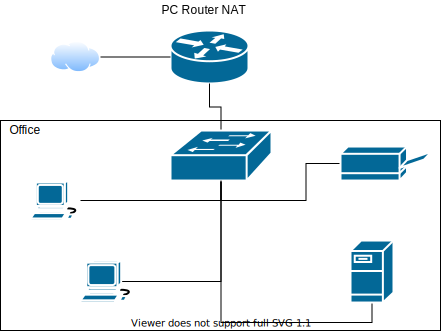

# Zadanie 1

Organizacja planuje ulepszyć działanie istniejącej sieci biurowej.

1. Zaprojektuj oraz udokumentuj konfigurację prototypu rozwiązania z wykorzystaniem oprogramowania ``VirtualBox`` lub podobnego. 

## Schemat

## Wymagania

W sieci pracują komputery biurowe oraz urządzenia siecowe współdzielące zasoby. Do tej pory organizacja borykała się z ręczna konfiguracją urządzeń oraz adresami IP które dla ludzi z poza kadry technicznej były niezrozumiałe. Postanowiono:

* Wykorzystać usługę DHCP do nadawania adresów w sposób automatyczny dla wszystkich stacji roboczych
* Serwer oraz durządzenia IP tj: drukarka muszą posiadać stałe adresy celem zminimalizowanai potrzeby rekonfiguracji ustawiań klientów
* Wprowadzić translację pomiędzy Adresami IP oraz nazwami domenowymi dla kluczowych zasobów
   - erp.mojaorganizacja.pl
   - drukarka.mojaorganizacja.pl
   - router.mojaorganizacja.pl
* Wszystkie urządzenia łączą się z siecią internet z wykorzystaniem bramy NAT
* Wykorzystać podsieć rozmiaru /22 pozwalającej zaadresować co najmniej 600 urządzeń

## Zawartość dokumentacji

 * Charakterystyka rozwiazania 
 * Adresy sieci IP
 * Oprogramowanie wykorzystane do realizacji poszczególnych wymagań
 * Kluczowa konfiguracja oprogramowania pozwalająca na odtworzenie stanu po reinstalacji środowiska
    1. Konfiguracja NAT z iptables 
    2. Konfiguracja DHCP
    3. Konfiguracja DNS
    4. Konfiguracja interfejsów sieciowych
    5. Inne jeżeli wykorzystane

## Rozwiązanie

* Router  
eth0: do sieci rozległej  
eth1: aders statyczny: 10.192.192.1 maska: 255.255.252.0
* Server  
eth0: adres statyczny 10.192.192.2 maska 255.255.252.0  
* Drukarka
eth0 adres statyczny 10.192.192.3 maska 255.255.252.0

## DHCP
Usługa dhcp skonfiugrowana jest na routerze poprzez użycie programu "dhcpd"  
dodano wpis konfiguracyjny w /etc/dhcp/dhcpd.conf  
Subnet 10.192.192.0 netmask 255.255.252.0 {  
range 10.192.192.4 10.192.195.254;  
option routers 10.192.192.1;
option domain-name-servers 10.192.192.1, 8.8.8.8, 1.1.1.1}  
Przedstawiona konfiguracja pozwala na dynamiczne nadawanie adresów z przedziału 10.192.192.4--10.192.195.254  
oraz definuje bramę domyślną, i serwery dns na urządzeniach pracujących w sieci.  

## NAT  
Usługa nat skonfigurowana jest na routerze poprzez użycie programu "iptables"  
dodano wpis konfiguracyjny: iptables -t  nat -A POSTROUTING -o eth0 -j MASQERADE  
echo 1 > /proc/sys/net/ipv4/ip_forward  
przedstawiona konfiguracja pozwala na translacje adresów na interfejsie eh0 oraz pozwala na przekazywanie pakietów pomiędzy interfejsami routera.  

## DNS

Usługa nat skonfigurowana jest na routerze poprzez użycie programu "dnsmasq"  
dodano następujący wpis konfiguracyjny w pliku /etc/hosts
10.192.192.1   router.myorg.pl  
10.192.192.2   erp.myorg.pl  
10.182.192.2   drukarka.myorg.pl  
przedstawiona konfiguracja pozwala na zamiane przedstawionych nazw na odpowiadające im adresy ip.  

